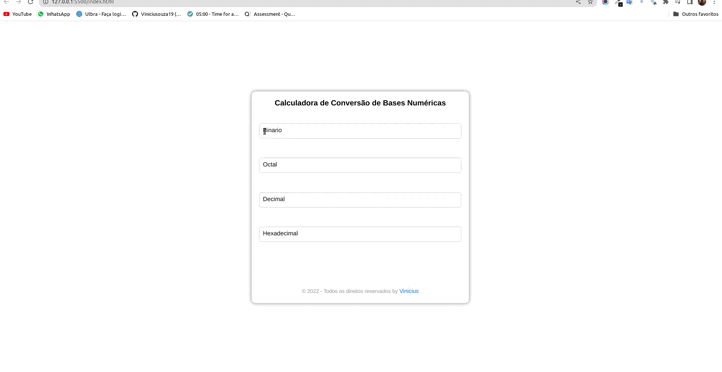

# Conversor de bases numéricas

## Descrição
- Conversor de bases numéricas para bases de 2 a 16

## Tecnologias
- JavaScript
- HTML
- CSS

## Gif do projeto

## Como usar
- Basta abrir o arquivo `index.html` no seu navegador e digitar na base que deseja converter que automaticamente será convertido para as outras bases.

## Agradecimentos
- Muito obrigado pela visita, espero que tenha gostado do projeto, qualquer dúvida ou sugestão, fique a vontade para entrar em contato comigo.

## Autor
- Vinicius de Souza Nascimento
- Recomenda meu Linkedin: https://www.linkedin.com/in/vinicius-de-souza-nascimento-644a0923a

## Release History
- 0.0.1 date 07/11/2022
    - Arrumando titulo do conversor
    - Adicionando gif do projeto
- 0.0.2 date 07/11/2022
    - Adicionando comentários no código
- 0.0.3 date 08/11/2022
    - Adicionando comentários ndo jeito dificil de fazer a conversao de bases
- 0.0.4 date 09/11/2022
    - Adicionando comentários no código
- 0.0.5 date 9/11/2022
    - Reformulando o codigo deixando mais limpo e organizado

## Emojis no README.md
- :sparkles: Nova funcionalidade
- :bug: Correção de bug
- :memo: Documentação
- :rocket: Nova release
- :art: Melhoria na estrutura ou formato do código
- :zap: Melhoria de performance
- :recycle: Refatoração de código
