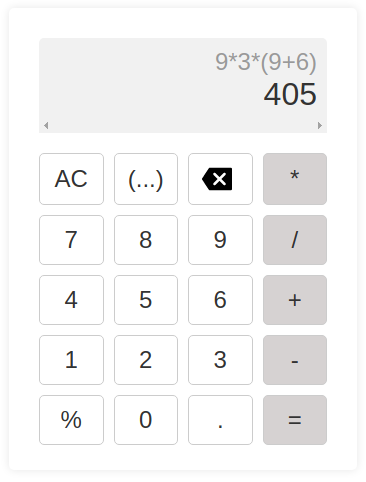

# Calculadora feita em Javascript

# Para rodar o projeto, basta abrir o arquivo index.html no seu navegador.

# Tecnologias utilizadas:

- HTML
- CSS
- Javascript

# Autor:

- Vinicius Souza

# Image Preview:

# Contato:

-Linkedin - https://www.linkedin.com/in/vinicius-de-souza-nascimento-644a0923a/

# Agradecimentos:
Projetinho simples feito para praticar o que aprendi sobre Javascript.

# Atualizaçõe v1 dia   7/10/2022:
- Adicionado a função de parenteses

# Atualizações v2 dia  7/10/2022:
- Adicionado a função de backspace

# correções 1 dia      7/10/2022:
- Corrigindo bug do parentes quando clicado backspace

# correções 2 dia      7/10/2022:
- Corrigindo bug dos parenteses ao apagar com backspace dnv kkkk
