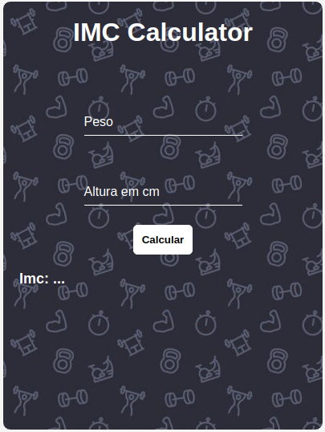

# imcCalculator
Calculadora de imc com javaScript

# Sobre o projeto
Projeto desenvolvido para calcular o imc de uma pessoa, utilizando javaScript.

# Tecnologias utilizadas
- HTML
- CSS
- JavaScript

# Autor
Vinicius de Souza

# Linkedin
https://www.linkedin.com/in/vinicius-de-souza-nascimento-644a0923a/

# Imagens do projeto

# Agradecimentos
Muito obrigado por ler meu readme ainda estou pegando o habito de escrever um readme decente, então qualquer dica é bem vinda.